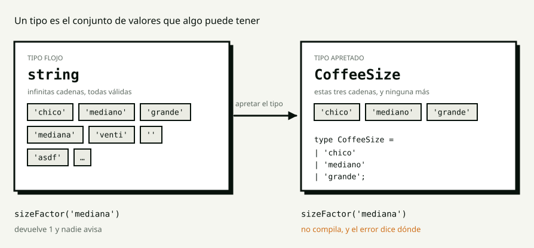

<!-- _class: portada -->

# S0

## TypeScript

<!--
Módulo Angular · Talento DH 8va.

El guión completo está en guion.md, y es un teleprompter: lo que está entre
comillas se dice. Estas notas son el resumen de cada diapositiva; si algo no
está acá, está allá.

Se ven con la tecla P en el HTML de Marp.

Es la PRIMERA clase del módulo. Preguntá quién no pudo instalar el entorno
ANTES de arrancar, y emparejalo con alguien que sí: hoy hay dos ejercicios y
los dos necesitan el proyecto levantado.
-->

---

<!-- _class: bloque -->

# 0:00

## Pregunta de apertura

<!--
5 minutos. Responden en el chat. Sin juicio, sin corregir, sin "casi".
Esperá 90 segundos en silencio. Si nadie escribe, contá vos uno tuyo.
-->

---

## La última vez que un programa te falló

no escribiéndolo — **usándolo**

# ¿qué era, al final?

<!--
"Se rompió con vos adelante, y cuando fuiste a ver qué había pasado era una
tontería: un nombre mal escrito, un dato que no estaba, un número que en
realidad era texto."

"Contame cuál fue en el chat. Con una línea alcanza."

Van a decir "me faltó un dato", "era undefined", "puse mal el nombre de una
propiedad". TODAS SIRVEN.

Cerrá con esto, textual:
"Fíjense en algo que tienen todas en común: EL ERROR YA ESTABA ESCRITO antes
de que el programa corriera. Estaba ahí, en el archivo, esperando. Nadie lo
leyó hasta que fue tarde. Hoy vamos a ver quién puede leerlo antes."

NO EXPLIQUES NADA TODAVÍA.
-->

---

<!-- _class: bloque -->

# 0:05

## Diagnóstico

## Tres programas de JavaScript

<!--
7 minutos. HOY NO HAY WAYGROUND: es la primera clase, no hay anterior.
Decilo: "de la clase que viene en adelante arrancamos siempre con un quiz de
lo anterior."

Las tres van al chat, UNA POR VEZ, 60 segundos cada una. No adelantes la
respuesta. Se ejecutan en la consola del navegador.
-->

---

<!-- _class: codigo -->

## ¿Qué imprime cada línea?

```js
const price = '42';

console.log(price * 2);
console.log(price + 2);
```

<!--
Sale 84 y '422'.

"El * convierte el texto a número. El + convierte el número a texto. Ninguna
de las dos falló, y una de las dos está mal — pero JavaScript no sabe cuál,
porque no sabe qué querías."
-->

---

<!-- _class: codigo -->

## ¿Y esto?

```js
const race = { name: 'Clásico Apertura' };

console.log(race.nombre);
```

<!--
Sale undefined. Sin error, sin aviso, sin nada.

"Escribí nombre en vez de name. Es el error más aburrido del mundo y
JavaScript me deja seguir. Ese undefined va a viajar por tu programa hasta
que rompa en un lugar que no tiene nada que ver, y ahí vas a debuggear el
lugar equivocado."
-->

---

<!-- _class: codigo -->

## ¿Cuánto sale un café «mediana»?

```js
function sizeFactor(size) {
  if (size === 'chico') return 0.8;
  if (size === 'grande') return 1.3;
  return 1;
}

sizeFactor('mediana');
```

<!--
Sale 1.

"Pedí un tamaño que no existe —mediana, con A— y me cobró el precio del
mediano. Sin error. Sin aviso. Un cliente pagó de menos y nadie se enteró
nunca."

CERRÁ EL BLOQUE ACÁ Y NO TE EXTIENDAS:
"Tres programas que NO FALLARON. Los tres están mal. Eso es lo que vamos a
arreglar hoy, y no se arregla poniendo más cuidado: se arregla poniendo a
alguien a revisar."
-->

---

<!-- _class: bloque -->

# 0:12

## El concepto

## Editor cerrado

<!--
A partir de acá, ni una línea de editor en pantalla. Solo diapositivas.

Si alguien pregunta "¿y el código?": "en ocho minutos. Primero quiero que
puedan dibujar esto en una servilleta."
-->

---

## Un tipo es un conjunto



<!--
TRES MINUTOS sobre este diagrama. Es el centro de la clase.

"Un TIPO es el conjunto de valores que una cosa puede tener. Nada más que
eso."

Panel izquierdo: "Acá está string. ¿Cuántas cadenas distintas hay? Infinitas.
'chico' es una cadena. 'mediana' también. 'asdf' también. Cuando yo digo que
el tamaño es un string, estoy diciendo CUALQUIERA DE ESTAS INFINITAS SIRVE.
Y no es lo que quiero decir. Yo quiero decir tres."

Panel derecho: "Esto es el mismo dato con el tipo apretado. Adentro tiene
exactamente tres cadenas. No es una regla escrita en un comentario: ES EL
TIPO."

La línea de abajo es el premio: "Miren qué pasa con 'mediana' en cada lado."
-->

---

<!-- _class: ojo -->

# Los tipos se borran

TypeScript **no existe** en el navegador.

Lo que corre es JavaScript, el mismo de siempre.

<!--
LO QUE MÁS CUESTA EL PRIMER DÍA. No lo pases rápido.

"¿Quién hace la revisión? Un programa que se llama COMPILADOR. Lee todo tu
código, chequea que los tipos cierren, y recién ahí escribe el JavaScript que
se va a ejecutar."

"Entonces, ¿para qué sirven los tipos? Para el rato en que escribís. Son un
andamio: sostienen mientras construís y después no van a la obra terminada."

Y el modo strict: "está prendido siempre, en los cuatro proyectos, y no lo
vamos a apagar ni un día."

Las cuatro preguntas que van a hacer —el navegador, equivocarse igual, si es
más lento, por qué no any— están en el guión con su respuesta.
-->

---

## Todo lo de hoy son cuatro preguntas

| | La pregunta que contesta el tipo |
|---|---|
| **Uniones de literales** | ¿Cuáles valores, exactamente? |
| **Opcionales y `undefined`** | ¿Puede no estar? |
| **`readonly`** | ¿Se puede cambiar? |
| **Genéricos · utility types** | ¿Cómo no repito el mismo tipo dos veces? |

<!--
DOS MINUTOS. Es el mapa de la clase.

"Las cuatro son la misma idea: DECIR LA VERDAD EN EL TIPO."

"Las tres primeras las vamos a escribir juntos ahora. La cuarta la vamos a
leer, y la practican en el ejercicio y en la tarea."

SI VAS TARDE: esta diapositiva es lo único recortable del bloque. El diagrama
y "los tipos se borran", no.
-->

---

<!-- _class: bloque -->

# 0:20

## Live coding

## Ustedes miran

<!--
DECILO TEXTUAL: "Cierren el editor. Los próximos quince minutos yo escribo y
ustedes miran. No copien: van a hacer esto mismo después, y con las manos
libres se entiende mejor. Si me equivoco, avisen."

Proyecto: lab/demo, archivo src/app/sessions/s00/menu.ts. Preparado antes de
entrar con `node scripts/prep-demo.mjs`.

La secuencia de tecleo minuto a minuto, con las TRES roturas deliberadas y el
orden de sacrificio, está en mision-profe.md. Segundo monitor.

Y dejá la terminal del npm start A LA VISTA: hoy los errores salen ahí.
-->

---

<!-- _class: codigo -->

## Inferencia · 0:20

```ts
let price = 42;
price = 'cuarenta y dos';
```

## `TS2322: Type 'string' is not assignable to type 'number'.`

<!--
ROTURA DELIBERADA 1.

Primero el hover sobre MENU, sin escribir nada: "ya sabe que esto es una
lista de cafés. NADIE SE LO DIJO. Lo dedujo del valor."

Después estas dos líneas. Leé el error completo en voz alta.

"Yo nunca escribí number en ningún lado: lo dedujo de que puse 42. Y ahora me
lo sostiene."

Regla práctica al cerrar: "cuando el valor está ahí, no se anota. Se anota
cuando todavía no está: los parámetros, lo que devuelve, lo que viene de
afuera."
-->

---

<!-- _class: codigo -->

## La unión de literales · 0:22

```ts
export type CoffeeSize = string;
```

```ts
export type CoffeeSize = 'chico' | 'mediano' | 'grande';
```

## `TS2345: Argument of type '"mediana"' is not assignable…`

<!--
Primero mostrá que sizeFactor('mediana') COMPILA. Es el bug de las 0:05, ahora
con TypeScript prendido.

"¿Por qué pasa? Porque el parámetro es CoffeeSize, y CoffeeSize hoy es
string. Y 'mediana' es un string perfectamente válido."

Cambiás UNA línea y el error aparece cincuenta líneas más abajo:
"Eso es lo que compra apretar un tipo."

Definí acá UNIÓN (la barra: esto o esto) y LITERAL (un tipo con un solo valor
adentro).
-->

---

<!-- _class: codigo -->

## El `switch` que se queja solo · 0:25

```ts
switch (size) {
  case 'chico':   return 0.8;
  case 'mediano': return 1;
  case 'grande':  return 1.3;
}
```

## Sin `default`, y compila.

<!--
"TypeScript sabe que CoffeeSize tiene tres valores, ve que los cubrí a los
tres, y por eso sabe que esta función siempre devuelve algo."

ROTURA DELIBERADA 2 — agregale | 'jumbo' al tipo:
TS2366: Function lacks ending return statement and return type does not
include 'undefined'.

"Agregué un tamaño ARRIBA y el compilador me llevó al único lugar del programa
donde falta decidir qué hacer con él. ESO es lo que un comentario nunca va a
hacer por ustedes."

Sacá el 'jumbo'.
-->

---

<!-- _class: codigo -->

## Opcional y narrowing · 0:28

```ts
notes?: string;   // el tipo pasa a ser string | undefined
```

```ts
if (coffee.notes === undefined) {
  return base;
}
return `${base} — ${coffee.notes}`;
```

<!--
Primero señalá los dos notes: '' del MENU. "Es una mentira chiquita, y las
mentiras chiquitas se propagan: en todo el programa, no tiene nota y tiene una
nota vacía son lo mismo."

ROTURA DELIBERADA 3 — borrá los dos notes: '' y andá al navegador:
"Huila · Colombia — undefined". DEJALO DOS SEGUNDOS SIN ARREGLAR.

Y el momento del bloque: HOVER sobre coffee.notes arriba del if y abajo.
Arriba dice string | undefined. Abajo dice string.

"A eso se le dice NARROWING: adentro del if el tipo se achica, porque ahí ya
sabe más que afuera."
-->

---

<!-- _class: ojo -->

# `!` es una promesa

`menu[0]!` quiere decir *confiá en mí, siempre hay uno*.

**¿Podés cumplirla?**

<!--
0:31. Ejecutá cheapest([]):
TypeError: Cannot read properties of undefined (reading 'price')

"Ese signo de exclamación le está diciendo al compilador que se calle. Y no
puedo cumplir lo que le prometí."

LA REGLA, en una línea: "si te tienta poner un !, casi siempre lo que falta es
decir la verdad en el tipo."

Cambiá la firma a Coffee | undefined, sacá el !, y volvé al navegador: el
pizarrón SIGUE FUNCIONANDO, porque el template ya tenía el @else.

"El tipo no agregó trabajo. HIZO VISIBLE EL TRABAJO QUE YA HABÍA QUE HACER."
-->

---

<!-- _class: codigo -->

## `readonly` · 0:33

```ts
MENU.push({ id: 'c9', name: 'Trucho', origin: 'Ninguno', price: 1 });
```

## `TS2339: Property 'push' does not exist on type 'readonly Coffee[]'.`

<!--
Primero mostrá que el push COMPILA: "estoy modificando el menú del negocio
desde cualquier parte del programa, y nadie me dice nada."

Después poné readonly en los campos y en el array.

"readonly no congela nada en tiempo de ejecución: es una marca para el
compilador. Y alcanza, porque el que se equivoca es el que escribe."

"Esto va a estar en TODO el curso, y en la clase 3 va a ser la diferencia
entre que la pantalla se actualice y que no."
-->

---

<!-- _class: bloque -->

# 0:35

## Misión 1

## Ahora ustedes

<!--
15 minutos, individual, lab/starter, archivo sessions/s00/menu.ts.
Cinco TODO(S0). Enunciado completo en mision-estudiante-1.md.

DECÍ ESTAS DOS COSAS ANTES DE LARGAR:
1. "El archivo del componente NO SE TOCA. Los componentes son la clase que
   viene. Si algo se rompe ahí, el arreglo está en menu.ts."
2. "La terminal donde corre npm start es su segundo par de ojos. Tenganla a la
   vista."

ESTÁS EN SILENCIO. Reloj de pistas en el guión: 0:43 y 0:47.
-->

---

## Misión 1 — los cinco

1. Los tamaños son **tres**, y el tipo lo dice
2. Las notas de cata son **opcionales**
3. El menú **no se edita**
4. El `switch` **sin `default`**
5. Puede **no haber** café más barato

**Prohibido:** `any`, `!`, `as`

<!--
Dejala en pantalla los quince minutos.

Cada requisito del enunciado trae su verificación: una línea que hay que
escribir, ver fallar, y borrar. Eso es lo que hace que el ejercicio se
autocorrija.
-->

---

<!-- _class: bloque -->

# 0:50

## Comparten pantalla

<!--
Dos personas. Una que le funciona y una que no — a la segunda pedile permiso
ANTES.

PREGUNTÁS, NO CORREGÍS. Las cuatro preguntas están en el guión.

Lo más probable: alguien puso notes: string | undefined en vez de notes?:
string. NO LO MARQUES COMO ERROR: es una diferencia real de significado y el
que la encontró solo, entendió el tema. La explicación está en el guión.
-->

---

<!-- _class: bloque -->

# 1:00

## Descanso

## 10 minutos

<!--
"Vuelvan puntuales, que lo que viene es lo mejor de la clase."
-->

---

<!-- _class: bloque -->

# 1:10

## Predice y ejecuta

<!--
15 minutos. Los tres snippets están en predice-y-ejecuta/ y las respuestas
—VERIFICADAS con tsc, no de memoria— en respuestas.md.

EL ORDEN NO SE SALTEA:
1. Mostrás el código. NO LO EJECUTÁS.
2. "¿Qué va a pasar? Escribilo en el chat." 60 SEGUNDOS DE RELOJ.
3. Recién ahí, ejecutás.
4. Explicás la diferencia.

El paso 2 es todo el ejercicio.
-->

---

<!-- _class: codigo -->

## 1 · ¿Cuál de las dos compila?

```ts
const size = 'grande';
sizeFactor(size);            // A

const config = { size: 'grande' };
sizeFactor(config.size);     // B
```

<!--
Casi todos predicen que las dos.

COMPILA A. NO COMPILA B:
TS2345: Argument of type 'string' is not assignable to parameter of type
'CoffeeSize'.

Un const con un primitivo adentro nunca va a cambiar → tipo literal 'grande'.
Una propiedad de objeto SÍ puede cambiar → tipo ancho string. Eso es widening.

Hacé el hover sobre las dos ANTES de mostrar el error.

La frase: "el tipo no lo decide la letra que escribiste: lo decide QUIÉN PUEDE
CAMBIARLA MÁS ADELANTE."
-->

---

<!-- _class: codigo -->

## 2 · Las tres son `readonly`. ¿Cuáles compilan?

```ts
interface Order {
  readonly customer: string;
  readonly lines: OrderLine[];
}

order.customer = 'Beto';        // A
order.lines = [];               // B
order.lines.push({ … });        // C
```

<!--
Casi todos predicen que ninguna.

A y B fallan con TS2540. C COMPILA SIN UNA QUEJA.

"readonly en el campo protege LA CAJA, no lo que hay adentro. Nadie puede
reemplazar la lista por otra… y cualquiera puede vaciarla."

El arreglo, en el momento: readonly lines: readonly OrderLine[];

"Los dos readonly no son un error de tipeo. Cada uno cierra una puerta
distinta, y la que casi todos dejan abierta es la segunda."

Y por qué importa: en S3, un push sobre estado hace que la pantalla NO SE
ACTUALICE, sin ningún error.
-->

---

<!-- _class: codigo -->

## 3 · ¿Compila? ¿Y qué imprime?

```ts
const text = '{"name":"Clásico Apertura"}';
const race = JSON.parse(text) as Race;

console.log(race.name);
console.log(race.horses.length);
```

<!--
COMPILA PERFECTO. Ni un subrayado rojo.

Y al ejecutar:
Clásico Apertura
Uncaught TypeError: Cannot read properties of undefined (reading 'length')

"JSON.parse devuelve any. El as no verifica NADA: le dice al compilador
'tratá esto como una carrera' y el compilador obedece."

AS NO ES UNA CONVERSIÓN. ES UNA PROMESA. Y esta no se podía cumplir.

Cierre del bloque: "¿cuál les parece más peligroso en un proyecto de verdad?"
Eligen el tercero, y tienen razón: los dos primeros los descubrís escribiendo,
el tercero compila, pasa el build, se despliega y rompe con un usuario
adelante.
-->

---

<!-- _class: bloque -->

# 1:25

## Misión 2

## En parejas

<!--
20 minutos. project/frontend/starter, archivo core/models/race.model.ts.
Diez minutos cada uno al teclado. El que dicta no toca el teclado; el que
escribe no decide.

TRES COSAS ANTES DE LARGAR:
1. "Los nombres de los campos YA ESTÁN BIEN. No se cambia ni uno: son el
   contrato con el backend, y hay código Go del otro lado."
2. "Lo que hay que apretar sale de docs/contract/openapi.yaml. No se adivina,
   se abre."
3. "El ejercicio NO ES QUE COMPILE. Es que cinco líneas que hoy compilan dejen
   de compilar. Están al final del enunciado."
-->

---

## Misión 2 — lo que tiene que dejar de compilar

| | La línea | El error |
|---|---|---|
| a | `race.status === 'galopando'` | `TS2367` |
| b | `horse.odds = 1.01` | `TS2540` |
| c | `race.horses.push(horse)` | `TS2339` |
| d | `{ place: 0, … }` | `TS2322` |
| e | `favourite(race).name` | `TS2532` |

<!--
Dejala en pantalla los veinte minutos. Los mensajes completos están en el
enunciado y en correccion.md.

Circulás entre las parejas. ESCUCHÁS MÁS DE LO QUE HABLÁS.

La pareja que termina recibe la extensión: leer api.model.ts y contestar por
qué Page<T> es genérico y qué pasa cuando el backend agrega un código de
error.
-->

---

<!-- _class: bloque -->

# 1:45

## Code review

<!--
10 minutos. Una solución de la Misión 2, con permiso. correccion.md en
pantalla al lado.

DECÍ ESTO PRIMERO, TEXTUAL:
"La rúbrica que vamos a usar todo el módulo arranca con '¿es standalone?' y
'¿es OnPush?'. Hoy esas dos preguntas no aplican: no hay un solo componente en
juego. Desde la clase que viene sí. Hoy revisamos otras cinco."
-->

---

## La rúbrica de hoy

1. ¿El tipo dice **exactamente** lo que el contrato garantiza?
2. ¿Quedó algún `!` o `as` que sea una promesa incumplible?
3. ¿Lo que no se edita está `readonly`?
4. ¿Los nombres están en inglés y dicen lo que la cosa es?
5. ¿Se abrió el contrato, o se adivinó?

<!--
EMPEZÁ POR ALGO QUE ESTÁ BIEN HECHO. Siempre hay algo.

Los cinco errores que aparecen todos los años, con qué decirles, están en
correccion.md.

CERRÁ CON ESTO:
"Ninguno de estos cambios se ve en la pantalla. La app hace exactamente lo
mismo que hace veinte minutos. Lo que cambió es que ahora hay una clase entera
de errores que ya no se puede escribir — y eso lo van a agradecer en la clase
7, cuando estos mismos tipos vengan de un servidor de verdad."
-->

---

<!-- _class: bloque -->

# 1:55

## Exit ticket

## y tarea

<!--
Exit ticket: tres preguntas, tres minutos. La tercera —qué quedó confuso— es
la que arranca S1.

Tarea: LEELA EN VOZ ALTA antes de cortar.
-->

---

<!-- _class: ojo -->

# `conceptos.md`

Todo lo de hoy, con **los ejemplos exactos** que corrimos acá.

La clase no queda grabada. Esto sí.

<!--
NO LO SALTEES POR FALTA DE TIEMPO. Es lo que más se olvida y lo único que
tienen entre esta clase y la que viene.

"Cada concepto con su definición, y los errores con su mensaje literal.
Ténganlo abierto al lado del editor cuando hagan la tarea."

Y el aviso de la próxima:
"La clase que viene arrancamos con Angular de verdad: el primer componente.
Vengan con el proyecto levantado, que los quince minutos de instalar cosas se
los quiero ahorrar."
-->

---

<!-- _class: portada -->

# Hasta la próxima

## S1 · Primer componente

<!--
Y anotá, todavía con la clase fresca, las cuatro preguntas del final del
guión: qué bloque se pasó, qué no supiste contestar, qué error apareció que no
estaba previsto, cuántos llegaron con el entorno instalado.

Eso es lo que hace que S1 salga mejor.
-->
