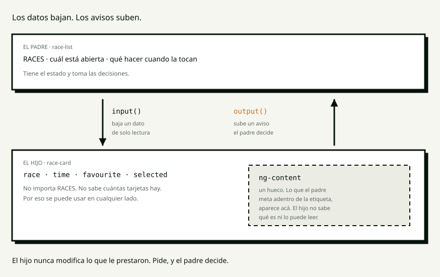

# S2 · Conceptos — Anatomía de un componente

> **Para qué es este archivo.** La clase es en vivo y no queda grabada. Cuando te
> sientes a hacer la tarea, esto es lo que tenés en vez de la memoria: cada
> concepto que vimos, con su definición y **los ejemplos exactos que corrimos en
> clase**.

**Índice**

1. [El problema: HTML repetido](#1-el-problema-html-repetido)
2. [Padre e hijo](#2-padre-e-hijo)
3. [`input()` — los datos bajan](#3-input--los-datos-bajan)
4. [`output()` — los avisos suben](#4-output--los-avisos-suben)
5. [`model()` — las dos cosas](#5-model--las-dos-cosas)
6. [`ng-content` — el hueco](#6-ng-content--el-hueco)
7. [El ciclo de vida](#7-el-ciclo-de-vida)
8. [Cómo se decide el corte](#8-cómo-se-decide-el-corte)
9. [Los errores de hoy y qué significan](#9-los-errores-de-hoy-y-qué-significan)
10. [Glosario](#10-glosario)

---

## 1. El problema: HTML repetido

En S1, cada carrera se dibujaba adentro del `@for` del listado: unas veinte
líneas de HTML. Funciona perfecto **para esa pantalla**.

El problema aparece cuando el mismo aspecto hace falta en otro lado. Copiar y
pegar no es difícil; lo difícil es lo que viene después:

> El HTML repetido no es feo. Es **un compromiso de mantenimiento que nadie
> firmó**: a partir de la copia, cada cambio hay que acordarse de hacerlo en dos
> lugares. Y siempre hay uno que queda viejo.

---

## 2. Padre e hijo

> **Padre** es el componente que usa a otro adentro de su template.
> **Hijo** es el usado. No sabe quién lo usa, y eso es la clave.



Un componente hijo tiene exactamente dos puertas:

| | Dirección | Qué pasa |
|---|---|---|
| **`input()`** | padre → hijo | un dato, de solo lectura |
| **`output()`** | hijo → padre | un aviso |

Y la frase de la clase:

> **El hijo nunca modifica lo que le prestaron. Pide, y el padre decide.**

Con una sola dirección, cuando algo está mal se sabe dónde mirar. Si el hijo
también pudiera cambiar los datos, habría dos lugares decidiendo lo mismo — y
tarde o temprano dicen cosas distintas.

Y para que el hijo aparezca hay que declararlo, como todo:

```ts
imports: [CoffeeCardComponent],
```

> Es la misma regla de `FormsModule` en S1: **si el template usa algo, va en
> `imports`.** Ahora vale también para los componentes propios.

---

## 3. `input()` — los datos bajan

```ts
readonly coffee = input.required<Coffee>();   // obligatorio
readonly featured = input(false);             // opcional, con valor por defecto
```

En el template del **hijo** se leen **con paréntesis**:

```html
<h3>{{ coffee().name }}</h3>
```

> `input()` no devuelve el dato: devuelve una **función que da el dato**. Por eso
> los paréntesis. Es exactamente la misma forma de los signals de la sesión 3, y
> no es casualidad — es lo mismo.

En el **padre**, con la sintaxis de S1:

```html
<app-coffee-card [coffee]="item.coffee" [featured]="true" />
```

### `required` es una promesa que verifica el compilador

```html
<app-coffee-card />
```

```
NG8008: Required input 'coffee' from component CoffeeCardComponent must be specified.
```

No es documentación ni una convención: es un error de compilación, del mismo
tipo que los de S0.

---

## 4. `output()` — los avisos suben

En el **hijo**:

```ts
readonly ordered = output<OrderRequest>();

protected order(): void {
  if (!this.coffee().available) return;
  this.ordered.emit({ coffee: this.coffee(), quantity: this.quantity() });
}
```

En el **padre**:

```html
<app-coffee-card (ordered)="take($event)" />
```

```ts
protected take(request: OrderRequest): void {
  this.orders = [...this.orders, `${request.quantity} × ${request.coffee.name}`];
}
```

**Dos cosas que hay que tener claras:**

| | |
|---|---|
| Los paréntesis son los mismos de `(click)` | La diferencia es que `click` lo inventó el navegador y `ordered` lo inventaste vos |
| `$event` **no** es un evento del DOM | Es exactamente el objeto que el hijo pasó a `emit()`, con su tipo |

### Y el silencio

Si el padre **no escribe** `(ordered)="…"`, el hijo emite igual, al vacío:

> **No hay error. No hay advertencia. El botón se aprieta y no pasa nada.**

Compila, pasa el build y se despliega. Fue el segundo «predice y ejecuta» de la
clase, y es la misma familia de bug que el `(click)="contador + 1"` de S1.

---

## 5. `model()` — las dos cosas

```ts
readonly quantity = model(1);
```

```html
<app-coffee-card [(quantity)]="item.quantity" />
```

> `model()` es `input()` y `output()` en la misma línea. Habilita los corchetes
> con paréntesis adentro **sobre un componente propio** — lo que en S1 solo se
> podía hacer con `ngModel` sobre un `<input>` de HTML.

El hijo lo cambia con `set`, no asignando:

```ts
this.quantity.set(next);
```

### El detalle que sorprende

Cuando **el hijo** sube la cantidad, su propio `ngOnChanges` corre.

Parece raro —el cambio no vino del padre— y sin embargo es correcto: el hijo
emite, el padre guarda el valor nuevo en `item.quantity`, y ese valor **vuelve a
bajar** por el mismo binding. Da toda la vuelta. Para el hijo es un input que
cambió, porque cambió.

---

## 6. `ng-content` — el hueco

> **Proyección de contenido** es que el padre meta HTML propio adentro de la
> etiqueta del hijo. `<ng-content>` es el hueco donde eso cae.

En el **hijo**:

```html
<div class="card__tag">
  <ng-content select="[card-tag]" />
</div>
…
<div class="card__slot">
  <ng-content />
</div>
```

En el **padre**:

```html
<app-coffee-card [coffee]="item.coffee">
  <span card-tag class="tag">Café del día</span>
  <p class="note">Vuelve el jueves.</p>
</app-coffee-card>
```

| | |
|---|---|
| `<ng-content select="[card-tag]" />` | recibe solo lo que lleva ese atributo |
| `<ng-content />` sin `select` | el cajón de sastre: todo lo demás |

**El hijo no sabe qué le proyectaron y no lo puede leer.** Solo le reserva el
lugar.

### Cuándo `input()` y cuándo `ng-content`

| Si es… | Va por |
|---|---|
| un **dato** que el hijo usa para decidir algo | `input()` |
| **marcado** que el hijo solo tiene que mostrar | `ng-content` |

La pastilla de estado es marcado: si su texto fuera un `input()`, el día que
alguien quiera ponerle un icono al lado hay que agregar un input nuevo. Y
después otro.

### Dos `<ng-content>` iguales

```html
<ng-content />
<ng-content />
```

**Compila sin una queja, y el contenido aparece una sola vez.** El segundo hueco
queda vacío para siempre. Fue el tercer «predice y ejecuta».

Va **uno solo** sin `select` por componente. Si hacen falta dos lugares
distintos, se distinguen con `select`.

---

## 7. El ciclo de vida

> El **ciclo de vida** son los momentos por los que pasa un componente. Angular
> llama a estos métodos por vos; nadie los invoca a mano.

| Gancho | Cuándo corre | Para qué |
|---|---|---|
| `ngOnInit` | una vez, con los inputs **ya llenos** | preparar lo que depende de los inputs |
| `ngOnChanges` | cada vez que el padre cambia un input | reaccionar a un dato nuevo |
| `ngOnDestroy` | cuando el componente se va de la pantalla | soltar lo que quedó abierto |

```ts
export class CoffeeCardComponent implements OnInit, OnChanges, OnDestroy {
  ngOnInit(): void {
    this.mountedAt = /* la hora */;
  }

  ngOnChanges(): void {
    this.changes += 1;
  }

  ngOnDestroy(): void {
    this.destroyed.emit(this.coffee().name);
  }
}
```

> **Por qué no se puede leer un input en el constructor:** cuando el constructor
> corre, Angular todavía no llenó los inputs. `ngOnInit` es el primer momento en
> que ya están.

`ngOnDestroy` hoy solo avisa un nombre. En la sesión 6 va a ser lo que evita que
la aplicación se coma la memoria.

---

## 8. Cómo se decide el corte

Es la pregunta difícil de la sesión, y tiene una regla:

> **Lo que el hijo necesita para dibujarse, entra por `input()`.
> Lo que decide la pantalla, se queda en el padre.**

En el listado de carreras:

| | Dónde quedó | Por qué |
|---|---|---|
| Los datos de la carrera | **input del hijo** | los necesita para dibujarse |
| La hora ya formateada | **input del hijo** | la tarjeta no decide cómo se escribe una fecha |
| Cuál está abierta | **estado del padre** | solo puede haber una, y la tarjeta no ve a las otras siete |
| Qué pasa al tocarla | **método del padre** | el hijo solo avisa |

Y el test que se puede hacer solo:

> **Tapá el archivo del padre. Leyendo únicamente el hijo, ¿podés decir para qué
> sirve y qué necesita?** Si sí, el corte está bien. Si tenés que ir a ver quién
> lo usa, quedó atado a una sola pantalla.

El error más común de la clase fue llevarse **la comanda** al hijo. Entonces cada
tarjeta tiene su propia lista y ninguna tiene todo: la comanda es de la pantalla.

Y una regla de carpetas que vale para todo el curso:

| | Va en | Porque |
|---|---|---|
| `<app-badge>` | `shared/ui/` | es una primitiva; **no sabe qué es una carrera** |
| `<app-race-card>` | `features/races/` | sí sabe qué es una carrera |

`shared/` nunca importa de `features/`.

---

## 9. Los errores de hoy y qué significan

### NG8008 — falta un input obligatorio

```
Required input 'coffee' from component CoffeeCardComponent must be specified.
```

**Qué dice:** declaraste el input con `input.required()` y lo usaste sin pasarlo.
**Cómo se arregla:** `[coffee]="…"` en el padre.

### El hijo no aparece en la pantalla

Falta el componente en los `imports` del padre. Es el error número uno de la
sesión, y el mismo de `FormsModule` en S1.

```ts
imports: [CoffeeCardComponent],
```

### `coffee.name` no compila

Un `input()` es una función. En el template va con paréntesis:

```html
{{ coffee().name }}
```

Sin ellos le estás pidiendo el `name` a la función, no al café.

### El botón no hace nada, y no hay error

Nadie escucha el `output()`. Revisá que el padre tenga `(ordered)="…"` escrito, y
que el nombre coincida con el del hijo.

**No hay ningún mensaje que ayude con esto.** Es la razón por la que estuvo en el
bloque de predicciones.

---

## 10. Glosario

| Palabra | Qué es |
|---|---|
| **Padre** | El componente que usa a otro adentro de su template |
| **Hijo** | El componente usado; no sabe quién lo usa |
| **Componer** | Armar una pantalla juntando componentes |
| **`input()`** | Un dato que baja del padre al hijo, de solo lectura |
| **`input.required()`** | Igual, pero sin él no compila |
| **`output()`** | Un aviso que sube del hijo al padre |
| **`emit()`** | Mandar el aviso |
| **`$event`** | En un `(output)`, el dato que el hijo pasó a `emit()` |
| **`model()`** | Entrada y salida a la vez: habilita `[(propiedad)]` |
| **Proyección de contenido** | Que el padre meta HTML adentro de la etiqueta del hijo |
| **`ng-content`** | El hueco donde cae ese HTML |
| **`select`** | El filtro que separa un hueco de otro |
| **Ciclo de vida** | Los momentos del componente: se crea, cambia, se destruye |
| **`ngOnInit`** | Corre una vez, con los inputs ya llenos |
| **`ngOnChanges`** | Corre cuando el padre cambia un input |
| **`ngOnDestroy`** | Corre al irse de la pantalla |

---

## Para la tarea

Con esto alcanza para hacer `tarea.md` sin nada más.

Lo que **no** vimos hoy y no hace falta todavía: qué es exactamente un signal
—los paréntesis de `coffee()` recién se explican en la sesión 3—, cómo se
comparte estado entre componentes que no son padre e hijo (sesión 5), y
`@defer` (sesión 10).
