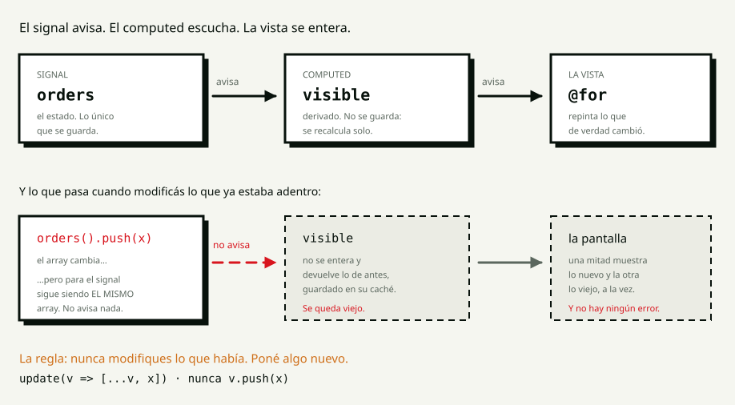

<!-- _class: portada -->

# S3

## Signals y control flow

<!--
Módulo Angular · Talento DH 8va.
El guión completo está en guion.md y es un teleprompter. Tecla P para las notas.
-->

---

<!-- _class: bloque -->

# 0:00

## Pregunta de apertura

---

## La clase pasada escribimos `coffee()`

con paréntesis, como si fuera una función

# ¿Por qué?

<!--
90 segundos de silencio. Van a decir "porque es una función", "para que se
actualice", "no sé". TODAS SIRVEN.

Cerrá con esto:
"El que dijo PARA QUE SE ACTUALICE está muy cerca. Un dato común no puede
avisar cuando cambia: es un número, se queda ahí. Para avisar hay que ser algo
más que un número — y eso es lo que vamos a ver hoy."
-->

---

<!-- _class: bloque -->

# 0:05

## Wayground

## de S2

<!--
sesiones/s02-anatomia-componente/wayground.csv
Máximo 30 segundos por pregunta. Los tres tropiezos esperables están en el
guión. El de `output()` que nadie escucha conviene comentarlo: hoy aparece un
primo suyo todavía más silencioso.
-->

---

<!-- _class: bloque -->

# 0:12

## El concepto

## Editor cerrado

---

## Seis cosas en la pantalla. Solo tres se guardan.

| | |
|---|---|
| **Estado** | las comandas · el filtro · la búsqueda |
| **Derivado** | cuántas pendientes · cuánto falta cobrar · las más caras |

<!--
DOS MINUTOS.

"Las tres de abajo salen de las tres de arriba. Guardarlas es firmar un
compromiso: cada vez que cambie una comanda hay que acordarse de actualizar las
tres. Y un día te olvidás de una, y la pantalla miente."

ESTADO es lo que nadie puede deducir de otra cosa.
DERIVADO es lo que sale de calcular sobre el estado.
-->

---

## El signal avisa. El computed escucha.



<!--
SEIS MINUTOS sobre este diagrama. Es la sesión entera.

PRIMERO LA FILA DE ARRIBA (3 min):
"Un SIGNAL es un valor que AVISA cuando cambia. Se lee llamándolo —orders()— y
ahí está el porqué de los paréntesis de la clase pasada: al leerlo, el signal
ANOTA QUIÉN LO LEYÓ. Por eso después puede avisarle."

"Un computed NO GUARDA NADA: se calcula. Y guarda su último resultado hasta que
su fuente cambie — está MEMOIZADO. Por eso se puede poner en el template sin
culpa, a diferencia de un método."

DESPUÉS LA FILA DE ABAJO (3 min):
"orders().push(x). El array cambia. Pero para el signal es EL MISMO ARRAY. No
pasó nada. No avisa."

Y lo que casi nadie espera:
"¿Qué se ve? LA MITAD DE LA PANTALLA SE ACTUALIZA IGUAL. El @for que lee
orders() directo se relee cuando Angular revisa. Pero el computed nunca se
recalcula. Te queda una pantalla con seis filas y un total que dice cinco. Sin
un error. Sin un log."
-->

---

<!-- _class: ojo -->

# Nunca modifiques lo que había

`update(v => [...v, x])`

nunca `v.push(x)`

<!--
La regla de la sesión. Dejala en pantalla.

Si preguntan por qué el readonly está desde S0: "para que este bug no se pueda
escribir. Lo vamos a ver en dos minutos."
-->

---

<!-- _class: bloque -->

# 0:20

## Live coding

## Ustedes miran

<!--
Proyecto: lab/demo, ruta /s03. La ruta la sumás VOS antes de entrar.

Y el NAVEGADOR A LA VISTA todo el bloque: la rotura de las 0:26 no se ve en la
terminal.

Secuencia y orden de sacrificio: mision-profe.md.
-->

---

<!-- _class: codigo -->

## De propiedad a signal · 0:20

```ts
protected orders = signal<readonly Order[]>(INITIAL_ORDERS);
```

## La pantalla queda exactamente igual.

<!--
Poné los paréntesis en los cuatro métodos y en el @for.

DECILO EN VOZ ALTA: "hasta acá no ganamos nada. Cambiamos cómo se escribe, no
qué hace. Lo que se gana aparece en el próximo paso, y si no lo ven venir esto
parece burocracia."
-->

---

<!-- _class: codigo -->

## El primer `computed` · 0:23

```ts
readonly pendingTotal = computed(() =>
  this.orders()
    .filter((o) => o.status !== 'served')
    .reduce((sum, o) => sum + lineTotal(o), 0),
);
```

<!--
Tocá los cuatro botones y mostrá el número siguiendo solo.

"Miren lo que NO escribí. No lo guardé en ninguna propiedad. Y no lo actualicé
en advance, ni en remove, ni en add, ni en reset. CUATRO LUGARES DONDE NO HAY
QUE ACORDARSE DE NADA."

Si preguntan si se recalcula todo el tiempo: no, está memoizado.
-->

---

<!-- _class: codigo -->

## La rotura · 0:26

```ts
protected add(): void {
  this.orders().push(nuevaComanda);
}
```

## `Property 'push' does not exist on type 'readonly Order[]'.`

<!--
EL BLOQUE DE LA CLASE. NO LO APURES.

Primero el error del tipo: "el tipo de la sesión 0 no me deja escribir el bug.
Voy a sacarle el readonly un segundo — y quiero que se queden con ESTE GESTO,
porque es el momento exacto en el que hay que parar."

Sacá el readonly, tocá Agregar comanda, Y NO DIGAS NADA TRES SEGUNDOS.

"La fila apareció. El encabezado dice seis. Y el total NO SE MOVIÓ."
Tocá otros botones, filtrá, buscá. Sigue viejo.
"No hay error. No hay advertencia. Media pantalla dice una cosa y la otra media
dice otra, y van a seguir así hasta que alguien recargue."

Arreglá con update + spread, volvé a poner el readonly:
"Ahora sí entienden por qué el readonly está desde la primera clase. NO ES UNA
FORMALIDAD: es lo que hace que este bug no se pueda escribir."
-->

---

<!-- _class: codigo -->

## `track` es obligatorio · 0:30

```html
@for (order of visible(); track order.id) { … }
```

## `NG5002: @for loop must have a "track" expression`

<!--
Sacá el track para que salga el error.

"track es cómo Angular reconoce que la fila de Ana SIGUE SIENDO LA DE ANA
cuando la lista se filtra o se reordena. Con track order.id la mueve. Sin nada
con qué reconocerla, la destruye y la vuelve a crear — y con ella se va el
foco, el scroll y lo que el usuario estuviera haciendo ahí."

Si preguntan por $index: identifica la POSICIÓN, no la fila. En cuanto se
reordena, miente.
-->

---

<!-- _class: codigo -->

## `@switch` · 0:32

```html
@switch (filter()) {
  @case ('pending') { La barra está al día. }
  @case ('ready') { Ninguna lista para entregar. }
  @default { No hay comandas que coincidan. }
}
```

<!--
Filtrá por Pendientes y marcá las dos como listas, hasta vaciar la lista.

"Lo mismo que el switch de TypeScript de la sesión 0: el valor es una unión
cerrada, cubrís los casos."

"Y miren qué gana el usuario: un 'no hay nada' genérico no le dice si el filtro
está mal puesto o si de verdad no queda trabajo."
-->

---

<!-- _class: bloque -->

# 0:35

## Misión 1

## El tablero que se calcula solo

<!--
15 minutos, lab/starter. Enunciado en mision-estudiante-1.md.

DECILO ANTES DE LARGAR:
"El orden que menos duele es: primero pasás orders a signal y ponés los
paréntesis hasta que compile. RECIÉN AHÍ agregás lo derivado. Si arrancás por
el filtro vas a estar peleando dos cosas a la vez."

Reloj de pistas: 0:43 y 0:47.
-->

---

## Misión 1 — los seis

1. La ruta `/s03` existe
2. La comanda es un `signal`, y se cambia con `update`
3. Filtro y búsqueda: dos signals más
4. Todo lo demás, `computed` — **cuatro cosas**
5. `@for` con `track` · `@switch` para los mensajes
6. Ordenar **sin** tocar el original

**Prohibido:** `push`, `sort` sobre el estado, guardar lo derivado

<!--
Dejala en pantalla los quince minutos. El requisito 4 es el que separa.
-->

---

<!-- _class: bloque -->

# 0:50

## Comparten pantalla

<!--
PREGUNTÁS, NO CORREGÍS:
1. "¿Cuáles de tus valores son estado y cuáles derivados?"
2. "¿Qué pasa si toco este botón dos veces seguidas?"
3. "¿Dónde actualizás el contador?" — la respuesta correcta es EN NINGÚN LADO.

Lo más probable: alguien guardó `visible` en un signal y lo actualiza a mano.
"Anda perfecto. Contá cuántos lugares tocás para agregar un filtro nuevo. Ahora
contá cuántos tendrías con un computed."
-->

---

<!-- _class: bloque -->

# 1:00

## Descanso

## 10 minutos

---

<!-- _class: bloque -->

# 1:10

## Predice y ejecuta

<!--
Respuestas VERIFICADAS en el navegador. DOS DE LAS TRES no son lo que uno
diría, y una contradice lo que estaba escrito en el currículo.

mostrar → 60 segundos → ejecutar → explicar.
-->

---

<!-- _class: codigo -->

## 1 · `push` sobre el array de un signal

```ts
readonly items = signal<number[]>([1, 2]);
readonly total = computed(() => this.items().reduce((a, b) => a + b, 0));

mutate(): void { this.items().push(10); }
```

## Se ve `2` y `3`. Después del clic, ¿qué se ve?

<!--
NI 2 y 3, NI 3 y 13.

SE VE 3 y 3. La lista se actualiza; el computed NO, y no se recupera nunca
—probamos tocando otro signal distinto y siguió en 3—.

"Casi todos predicen que no se actualiza nada. La verdad es peor: SE ACTUALIZA
LA MITAD. Una pantalla donde todo está viejo se nota. Una donde la mitad está
vieja se descubre cuando un cliente reclama."

La frase: "el signal no vigila el contenido. Vigila SI LE PUSISTE OTRA COSA."
-->

---

<!-- _class: codigo -->

## 2 · Un `@for` sin `track`

```html
@for (order of visible()) {
  <li>{{ order.customer }}</li>
}
```

## ¿Compila?

<!--
NO COMPILA. NG5002.

"Es de las poquísimas cosas que Angular te obliga a escribir, y la razón es que
la alternativa —elegir por vos— sería peor en silencio."

Con track: la mueve. Sin track: la destruye y crea otra, y con ella se va el
foco, el scroll y el texto a medio escribir.
-->

---

<!-- _class: codigo -->

## 3 · Un `computed` que ordena

```ts
readonly numbers = signal<number[]>([3, 1, 2]);

readonly raw = computed(() => this.numbers().join(','));
readonly sorted = computed(() => this.numbers().sort((a, b) => a - b).join(','));
```

## Nadie llama a `set`. ¿Qué muestra `raw()`?

<!--
MUESTRA 1,2,3.

sort() ordena EN EL LUGAR: no devuelve una copia, devuelve el mismo array
reordenado. El computed le cambió el orden al array del signal, y raw —que solo
hacía join— empezó a ver otra cosa.

"Un valor que nadie cambió, cambió. Y el culpable está en otro archivo, en una
línea que parecía de solo lectura."

El arreglo son tres caracteres: [...this.numbers()].sort(...)

Cierre: "¿qué tienen en común los tres? MODIFICAR ALGO QUE OTRO ESTABA MIRANDO.
Y de los tres, el único que te avisa es el que te frena el build."
-->

---

<!-- _class: bloque -->

# 1:25

## Misión 2

## Filtrar el programa

<!--
20 minutos, en parejas. project/frontend/starter.

TRES COSAS ANTES DE LARGAR:
1. "El punto de partida es su listado de S2."
2. "LAS OCHO CARRERAS NO SON ESTADO. Vienen de una constante y no cambian
   nunca. Un signal para algo que no cambia es ruido."
3. "Guarden EL ID de la carrera abierta, no la carrera. Van a ver por qué
   solos, en cuanto filtren."
-->

---

## Misión 2 — el reparto

| Qué | Dónde |
|---|---|
| Las ocho carreras | **una constante** — no cambian |
| Filtro · búsqueda · id abierto | **tres signals** |
| Lo que se ve · contadores · pago | **computed** |
| La carrera abierta | **computed**, desde el id |

<!--
Dejala en pantalla los veinte minutos.

LA PRUEBA QUE HAY QUE HACER SÍ O SÍ, y decila en voz alta:
"Abrí una carrera terminada y, sin cerrarla, filtrá por En vivo. EL PANEL TIENE
QUE CERRARSE SOLO."
-->

---

<!-- _class: bloque -->

# 1:45

## Code review

<!--
Rúbrica del curso. Hoy el punto 2 —¿actualiza sin mutar?— es el que manda.

Los cinco errores de todos los años están en correccion.md.

LA PREGUNTA DE LA SESIÓN:
"Contá los signals. Si hay más de tres o cuatro en una pantalla de este tamaño,
casi seguro alguno es derivado y está guardado de más. Buscá el que se
actualiza a mano en dos lugares: ese es."
-->

---

<!-- _class: ojo -->

# El panel se cierra solo

Nadie escribió esa línea.

<!--
EL CIERRE DE LA SESIÓN, y conviene demostrarlo en vivo:

"Abrís una carrera terminada, filtrás por En vivo, y el panel de detalle se
cierra. Nadie escribió eso. Sale de haber guardado el id en vez del objeto, y
de derivar el resto."

"Eso es lo que se gana: los estados imposibles dejan de poder existir."
-->

---

<!-- _class: bloque -->

# 1:55

## Exit ticket

## y tarea

<!--
La tercera pregunta del exit ticket arranca S4.

Tarea: LEELA EN VOZ ALTA. El punto 2 —romperlo a propósito y describir el
síntoma— es el que más enseña.

Y el apunte: conceptos.md, con las tres respuestas del bloque de predicciones,
que son las que no se pueden adivinar.
-->

---

<!-- _class: portada -->

# Hasta la próxima

## S4 · Directivas y pipes

<!--
El anzuelo:
"La clase que viene: directivas y pipes. Vamos a sacar de los templates todos
esos toFixed(2) que venimos arrastrando desde la primera clase."
-->
