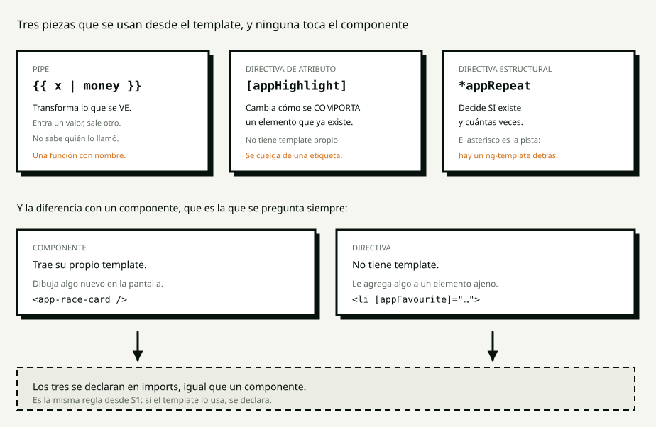

<!-- _class: portada -->

# S4

## Directivas y pipes

<!--
Módulo Angular · Talento DH 8va.
El guión completo está en guion.md y es un teleprompter. Tecla P para las notas.
-->

---

<!-- _class: bloque -->

# 0:00

## Pregunta de apertura

---

<!-- _class: codigo -->

## Esto lo venimos escribiendo desde S1

```html
{{ horse.odds.toFixed(2) }}
```

# ¿Cuántas veces va a estar escrito?

<!--
90 segundos. Van a decir 5, 20, 50. TODOS SIRVEN.

"El número exacto no importa. Lo que importa es que ES MÁS DE UNO, y que el día
que alguien pida las cuotas con coma en vez de punto hay que encontrarlos
todos."

"Hoy vamos a dejarlo escrito una sola vez."
-->

---

<!-- _class: bloque -->

# 0:05

## Wayground

## de S3

<!--
sesiones/s03-signals/wayground.csv. Máximo 30 segundos por pregunta.
El del push conviene comentarlo aunque salga bien: es el que más se olvida.
-->

---

<!-- _class: bloque -->

# 0:12

## El concepto

## Editor cerrado

---

## Tres piezas, y ninguna toca el componente



<!--
CUATRO MINUTOS sobre el diagrama.

"UN PIPE TRANSFORMA LO QUE SE VE. Entra un valor, sale otro. Es una función con
nombre que se puede usar desde el template, y no sabe quién la llamó — por eso
sirve para cualquier pantalla."

"UNA DIRECTIVA DE ATRIBUTO cambia cómo se comporta un elemento que ya existe.
No dibuja nada: se cuelga de una etiqueta y le agrega algo."

"UNA DIRECTIVA ESTRUCTURAL decide si un elemento existe y cuántas veces. El
asterisco es la pista."

Y la pregunta que siempre aparece, contestada antes de que la hagan:
"¿En qué se diferencia de un componente? En una sola cosa: UN COMPONENTE TRAE SU
PROPIO TEMPLATE. Una directiva no tiene, le agrega algo a un elemento ajeno."
-->

---

<!-- _class: ojo -->

# Si el template lo usa, se declara

Componentes · directivas · pipes

<!--
La misma regla desde S1, con la tercera cara.

"Y hay dos que ya usaron sin declararlas: @if y @for NO se declaran, porque no
son directivas — son sintaxis del template. *ngIf y *ngFor, que es lo que había
antes, sí lo eran."

SI VAS TARDE: esta diapositiva es lo único recortable del bloque.
-->

---

<!-- _class: bloque -->

# 0:20

## Live coding

## Ustedes miran

<!--
Proyecto: lab/demo, ruta /s04.

PREPARATIVO QUE NO ES MECÁNICO: quita las dos líneas del idioma de
app.config.ts antes de entrar, porque el bloque las agrega en vivo. Si te lo
olvidas, el porcentaje ya sale bien y se pierde la demostración.
-->

---

<!-- _class: codigo -->

## Los que ya vienen · 0:20

```html
{{ coffee.origin | uppercase }}
{{ coffee.stock | number }}
{{ share(coffee) | percent: '1.0-1' }}
```

## Sale `54.5%`. Y la pantalla está en español.

<!--
"Ese es todo el trato de un pipe: TRANSFORMA LO QUE SE VE, NO LO QUE HAY. El
dato sigue siendo Etiopía."

Y el porcentaje: "los pipes incorporados formatean según el idioma de la
aplicación, y ese idioma POR DEFECTO ES en-US. No es un error de Angular: es
que nadie le dijo en qué idioma está esto."

registerLocaleData(localeEs) + { provide: LOCALE_ID, useValue: 'es' }

"Dos líneas, una sola vez en la vida del proyecto. Ahora dice 54,5 %."
-->

---

<!-- _class: codigo -->

## Un pipe propio · 0:23

```ts
@Pipe({ name: 'money', standalone: true, pure: true })
export class MoneyPipe implements PipeTransform {
  transform(value: number, symbol = '$'): string { … }
}
```

## `NG8004: No pipe found with name 'money'.`

<!--
ROTURA DELIBERADA 1: úsalo ANTES de declararlo.

"No encontré ningún pipe que se llame money. Y tiene razón: lo escribí, pero no
le dije a ESTE componente que lo iba a usar. Es la misma regla de FormsModule en
S1 y de los componentes en S2."

Después el parámetro: {{ coffee.price | money: 'USD' }}
"Lo que va después de los dos puntos es el segundo argumento de transform()."

Si preguntan por useGrouping: en español el formato por defecto NO agrupa los
números de cuatro cifras. Para un número suelto es correcto; para un importe no.
-->

---

## Puro contra impuro · 0:27

| | Cuándo lo llama Angular |
|---|---|
| **`pure: true`** | solo cuando **cambia la entrada** |
| **`pure: false`** | cada vez que **revisa el componente** |

<!--
Baja al panel de contadores y toca el botón cinco o seis veces, despacio.

"Los dos pipes hacen exactamente lo mismo. Se diferencian en UNA PALABRA. El
puro se quedó en uno. El impuro sube con cada clic."

EL MATIZ QUE VUELVE A LAS 1:20, dilo ahora:
"Fíjate que dije REVISA ESTE COMPONENTE, no en cada clic de la aplicación. Este
componente es OnPush. Si fuera de detección por defecto, el número subiría con
cualquier clic de cualquier parte."

La regla: impuro se usa cuando el resultado depende de algo que la entrada no ve
—el reloj—. Casi siempre hay una forma mejor, y casi siempre es un computed.
-->

---

<!-- _class: codigo -->

## Una directiva de atributo · 0:30

```ts
@Directive({
  selector: '[appHighlight]',
  standalone: true,
  host: {
    '[class.is-highlighted]': 'appHighlight()',
    '[attr.data-highlight-label]': 'appHighlight() ? highlightLabel() : null',
  },
})
```

<!--
Antes de escribir nada, MUESTRA lo que hay en el template: la misma condición
escrita dos veces, y el nombre de la clase CSS decidido por la pantalla.

"El selector entre corchetes quiere decir CUALQUIER ELEMENTO QUE TENGA ESTE
ATRIBUTO. Y el input se llama igual que el selector para escribirlo una vez."

"host es donde la directiva declara qué le hace al elemento. Reemplaza a
@HostBinding y @HostListener, que es lo que vas a ver en código más viejo."

"Y fíjate qué desapareció del template: EL NOMBRE DE LA CLASE CSS. La pantalla
dice CUÁL está destacado; CÓMO se ve lo decide la directiva."

ROTURA DELIBERADA 2: quita standalone: true → TS-992011.
-->

---

<!-- _class: codigo -->

## El asterisco · 0:33

```html
<span *appRepeat="3">●</span>
```

```html
<ng-template [appRepeat]="3">
  <span>●</span>
</ng-template>
```

## Son exactamente lo mismo.

<!--
NO LA ESCRIBAS: ábrela y muéstrala.

"El asterisco es azúcar sintáctica: Angular reescribe la primera en la segunda
antes de compilar."

"Un ng-template es un pedazo de HTML que NO SE DIBUJA: queda guardado, y alguien
decide después si se pinta, cuántas veces y dónde. Eso es lo que hacían *ngIf y
*ngFor antes de que existieran @if y @for."

"En Angular 18 casi nunca hace falta escribir una propia. Está aquí para que
puedan LEER el código que las usa, que todavía es la mayoría."
-->

---

<!-- _class: bloque -->

# 0:35

## Misión 1

## Sacar el formateo del componente

<!--
15 minutos, lab/starter. Enunciado en mision-estudiante-1.md.

DILO ANTES DE LARGAR:
"Empieza por los pipes que ya vienen, que son los de una línea. El pipe propio
después. Las directivas al final, que son las que más cuestan."

Reloj de pistas: 0:43 y 0:47.
-->

---

## Misión 1 — los cuatro

1. Los pipes que ya vienen, **y el idioma**
2. `money`, con parámetro y puro
3. `appHighlight`, de atributo
4. `*appRepeat`, estructural

**El componente queda sin un solo método de formateo**

<!--
Déjala en pantalla los quince minutos.

El requisito 1 es el que más se olvida: si el porcentaje sale con punto, falta
LOCALE_ID.
-->

---

<!-- _class: bloque -->

# 0:50

## Comparten pantalla

<!--
PREGUNTAS, NO CORRIGES:
1. "¿Por qué esto es un pipe y aquello una directiva?"
2. "Si mañana hay que mostrar precios en otra pantalla, ¿qué tocas?"
3. "¿Tu pipe sabe qué es un café?" — la respuesta correcta es NO.

Lo más probable: el pipe recibe el café entero.
"Si el pipe recibe el café, ya no sirve para las carreras. Un pipe recibe EL
VALOR QUE TRANSFORMA, no el objeto que lo contiene."
-->

---

<!-- _class: bloque -->

# 1:00

## Descanso

## 10 minutos

---

<!-- _class: bloque -->

# 1:10

## Predice y ejecuta

<!--
Respuestas verificadas contra el compilador y contando llamadas en Karma.
mostrar → 60 segundos → ejecutar → explicar.
-->

---

<!-- _class: codigo -->

## 1 · Un pipe que existe y no se declara

```ts
imports: [],
template: `<p>{{ 4200 | money }}</p>`,
```

<!--
NO COMPILA. NG8004: No pipe found with name 'money'.

Tercera vez que aparece la misma regla: S1 con FormsModule, S2 con el hijo, S4
con el pipe.

EL ERROR HERMANO, que cuesta más: si el pipe SÍ está en imports y el error
sigue, el name del @Pipe no coincide con lo escrito en el template. SE COMPARAN
CADENAS, NO CLASES.

Al reproducirlo, quita también la línea de import: si la dejas sin usar sale
TS6133 y tapa el error que interesa.
-->

---

<!-- _class: codigo -->

## 2 · Una directiva sin `standalone`

```ts
@Directive({
  selector: '[appHighlight]',
  host: { '[class.is-highlighted]': 'appHighlight()' },
})
```

<!--
NO COMPILA.
TS-992011: The directive appears in 'imports', but is not standalone and cannot
be imported directly. It must be imported via an NgModule.

"En Angular 18, standalone NO es el valor por defecto: hay que escribirlo. Y es
el mismo error con un componente y con un pipe: LA REGLA ES UNA SOLA PARA LOS
TRES."
-->

---

<!-- _class: codigo -->

## 3 · Un pipe impuro con `OnPush`

```ts
@Pipe({ name: 'countImpure', pure: false })
```

## La entrada es siempre `'café'`. ¿Cuándo sube el contador?

<!--
NI "nunca" NI "con cada clic de la app".
SOLO CUANDO ANGULAR REVISA ESE COMPONENTE.

Tras seis clics: puro = 1, impuro = 7.

Casi todos eligen "con cada clic de la app", y la diferencia es la mitad del
tema: cuántas veces se revisa un componente depende de la estrategia.
Con Default, esa respuesta SÍ sería la correcta — y se puede demostrar cambiando
OnPush por Default en vivo.

EL CIERRE:
"Los dos primeros te los frena el compilador. El tercero NO FALLA NUNCA:
funciona, y es lento. Y lo lento no se ve con cuatro cafés. Se ve con cuatro mil
filas y un usuario que dice que la aplicación se traba."
-->

---

<!-- _class: bloque -->

# 1:25

## Misión 2

## Un solo lugar para cada formato

<!--
20 minutos, en parejas.

TRES COSAS ANTES DE LARGAR:
1. "Los tres archivos nuevos van en shared/, y NINGUNO sabe qué es una carrera."
2. "El pipe de cuotas reemplaza a toFixed(2), y de paso arregla algo que toFixed
   hacía mal. Van a ver qué en cuanto lo prueben."
3. "Acuérdense de LOCALE_ID."
-->

---

<!-- _class: codigo -->

## Lo que nadie había notado

```js
(2.4).toFixed(2)   // '2.40'  — siempre punto, en cualquier idioma
```

## Desde S1, en una aplicación en español.

<!--
Esta es la diapositiva que hace la sesión. Muéstrala en el code review si no
salió sola durante la misión.

"toFixed no sabe de idiomas. Estuvo mostrando un punto decimal desde la primera
clase y nadie lo vio. El pipe no solo evita repetir: ARREGLA ALGO QUE ESTABA
MAL."

Y la verificación del ejercicio:
grep -rn "toFixed" src/app/features/   → no tiene que devolver nada.
-->

---

<!-- _class: bloque -->

# 1:45

## Code review

<!--
Rúbrica del curso, más la pregunta de hoy:

"Tapa el nombre del archivo. Leyendo solo el pipe, ¿PODRÍAS DECIR DE QUÉ
APLICACIÓN ES? Si la respuesta es sí, sabe demasiado."

Los cinco errores de todos los años están en correccion.md.

EL CIERRE:
"Conté los toFixed que quedaron en el proyecto. Eran cinco y ahora es uno. Y el
día que alguien pida otro formato, se cambia ahí — no en cinco lugares, ni en
los tres que se van a escribir el mes que viene."
-->

---

<!-- _class: bloque -->

# 1:55

## Exit ticket

## y tarea

<!--
Tarea: LÉELA EN VOZ ALTA. El punto 2 —relativeTime y por qué un pipe no alcanza—
es el que más enseña, y prepara S6.

Y el apunte: conceptos.md.
-->

---

<!-- _class: portada -->

# Hasta la próxima

## S5 · Inyección de dependencias

<!--
El anzuelo:
"La clase que viene: inyección de dependencias. Vamos a sacar los datos de
adentro de los componentes, que es lo último que les queda encima."
-->
