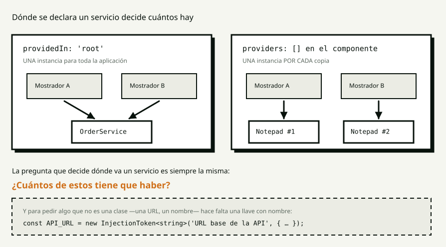

# S5 · Conceptos — Inyección de dependencias

> **Para qué es este archivo.** La clase es en vivo y no queda grabada. Cuando te
> sientes a hacer la tarea, esto es lo que tienes en vez de la memoria.

**Índice**

1. [El problema: dos hermanos](#1-el-problema-dos-hermanos)
2. [Qué es inyectar](#2-qué-es-inyectar)
3. [`inject()` y el contexto de inyección](#3-inject-y-el-contexto-de-inyección)
4. [Dónde se declara decide cuántos hay](#4-dónde-se-declara-decide-cuántos-hay)
5. [`InjectionToken`](#5-injectiontoken)
6. [Un store es un servicio con estado](#6-un-store-es-un-servicio-con-estado)
7. [Los errores de hoy](#7-los-errores-de-hoy)
8. [Glosario](#8-glosario)

---

## 1. El problema: dos hermanos

En S2 quedó claro que los datos bajan por `input()` y los avisos suben por
`output()`. Eso funciona **entre padre e hijo**.

Dos mostradores uno al lado del otro no son padre e hijo: son hermanos. Para que
compartan la comanda hay dos salidas malas:

| | Por qué no |
|---|---|
| Subir la comanda al padre | El padre termina guardando algo que no le importa, solo para que dos hijos se enteren. Con tres niveles, es pasar un dato por cinco componentes que no lo usan |
| Una variable global | Nadie es dueño de nada, no se puede reemplazar para probar, y todo el que la toque queda atado a ella |

---

## 2. Qué es inyectar

> **Un servicio** es una clase sin template, con lógica o con estado, que otros
> usan.

Si un componente escribiera `new OrderService()`, cada componente tendría el
suyo, con su propia comanda. No habría forma de que vieran lo mismo.

> **Inyección de dependencias** quiere decir que un objeto no se construye lo que
> necesita: **se lo pide a alguien**. Ese alguien es el **inyector**, y su trabajo
> es guardar las instancias y entregarlas.

La ventaja no es escribir menos:

> **Quien pide no decide cuántos hay.** Esa decisión se toma en otro lado, en una
> línea, y se puede cambiar sin tocar a nadie.

---

## 3. `inject()` y el contexto de inyección

```ts
export class CounterComponent {
  protected readonly orders = inject(OrderService);
  protected readonly shopName = inject(SHOP_NAME);
}
```

Se llama **en el campo de la clase**, y eso no es un capricho de estilo:

> Un **contexto de inyección** es el momento en que Angular está construyendo
> algo y sabe a qué inyector preguntarle.

Los cuatro lugares donde se puede, que es lo que dice el propio error:

- en el constructor
- en una factory
- **en un campo de la clase**
- dentro de `runInInjectionContext`

Cuando corre un método, Angular ya terminó de construir el componente. Por eso
esto falla:

```ts
protected take(): void {
  const service = inject(OrderService);   // ❌ NG0203
}
```

**`inject()` va arriba, siempre.**

---

## 4. Dónde se declara decide cuántos hay



```ts
@Injectable({ providedIn: 'root' })     // una para toda la aplicación
export class OrderService { … }
```

```ts
@Injectable()                            // sin providedIn
export class NotepadService { … }

@Component({ providers: [NotepadService] })   // una por cada copia del componente
export class CounterComponent { … }
```

| | Cuántas instancias |
|---|---|
| `providedIn: 'root'` | **una** para toda la aplicación |
| `providers` en un componente | **una por cada copia** de ese componente en pantalla |

Lo que se vio en clase: dos mostradores comparten la comanda —es **el mismo
objeto**, no una copia— y cada uno tiene su propio cuaderno.

### La pregunta que decide

> **¿Cuántos de estos tiene que haber?**

Una comanda: una. Un cuaderno de mostrador: uno por mostrador. La respuesta a esa
pregunta es la línea que hay que escribir.

### La jerarquía

Cuando un componente pide algo, Angular busca primero en el inyector de ese
componente; si no está, sube al padre, y así hasta la raíz. Por eso `providers`
en un componente **gana** sobre `providedIn: 'root'` — y por eso tener los dos
puestos crea dos instancias sin que nada avise. Es el primer «predice y ejecuta».

---

## 5. `InjectionToken`

Un servicio se pide por su clase. Una cadena no: no se puede escribir
`inject(string)`, porque habría un solo `string` para toda la aplicación y no
querría decir nada.

```ts
export const SHOP_NAME = new InjectionToken<string>('Nombre del café', {
  providedIn: 'root',
  factory: () => 'Café Compilado',
});
```

- El texto es solo para que los mensajes de error se entiendan.
- `factory` da el valor por defecto: funciona sin configurar nada.

Y se reemplaza en un solo lugar:

```ts
providers: [{ provide: SHOP_NAME, useValue: 'Otro café' }]
```

### Por qué no una constante exportada

Una constante se importa, y **quien la importa queda atado**: para probar contra
otro valor habría que tocar cada archivo que la usa.

En el hipódromo el token es `API_URL`. En S7, cambiar entre el backend Go real y
el mock va a ser exactamente esa línea, y ni un componente se entera.

---

## 6. Un store es un servicio con estado

**No es un patrón nuevo ni una librería.** Es lo de S3 con `providedIn: 'root'`
encima:

```ts
@Injectable({ providedIn: 'root' })
export class OrderService {
  private readonly _orders = signal<readonly Order[]>([]);

  readonly orders = this._orders.asReadonly();
  readonly count = computed(() => this.orders().length);

  add(customer: string, coffee: string): void {
    this._orders.update((orders) => [...orders, …]);
  }
}
```

Las dos líneas que hay que entender:

```ts
private readonly _orders = signal(…);          // se escribe adentro
readonly orders = this._orders.asReadonly();   // se lee afuera
```

> `asReadonly()` devuelve el mismo signal **sin `set` ni `update`**. Nadie de
> afuera puede escribir el estado: para cambiarlo hay que pasar por un método, y
> **los métodos son el contrato del servicio**.

### Un servicio puede inyectar servicios

```ts
@Injectable({ providedIn: 'root' })
export class BetStore {
  private readonly races = inject(RaceStore);
  readonly target = computed(() => this.races.selected()?.favourite);
}
```

El inyector no distingue quién pregunta. Fue el tercer «predice y ejecuta».

### Y ahora se puede testear sin componentes

```ts
TestBed.configureTestingModule({});
const store = TestBed.inject(RaceStore);
store.setFilter('live');
expect(store.visible().length).toBe(1);
```

Cuando el estado vivía dentro de `race-list`, para probar el filtro había que
crear el componente, dibujarlo y buscar botones en el DOM.

---

## 7. Los errores de hoy

### No hay proveedor

```
R3InjectorError[NotepadService -> NotepadService]: NullInjectorError:
No provider for NotepadService!
```

El servicio existe y compila. Falta que **alguien haya dicho dónde vive**: o
`providedIn` en el `@Injectable`, o el `providers` de un componente.

### NG0203 — `inject()` fuera de contexto

```
NG0203: inject() must be called from an injection context such as a constructor,
a factory function, a field initializer, or a function used with `runInInjectionContext`.
```

El mensaje dice exactamente dónde sí se puede. Casi siempre la causa es que
`inject()` quedó adentro de un método o de un callback.

### Y el que no da error

Un servicio con `providedIn: 'root'` **y además** declarado en `providers` de un
componente: hay dos instancias, y no hay ningún mensaje. El síntoma aparece
semanas después como «se me perdieron los datos».

---

## 8. Glosario

| Palabra | Qué es |
|---|---|
| **Servicio** | Una clase sin template, con lógica o estado |
| **Inyección de dependencias** | Pedir lo que se necesita en vez de construirlo |
| **Inyector** | Quien guarda las instancias y las entrega |
| **`inject()`** | La forma de pedir una dependencia |
| **Contexto de inyección** | Cuando Angular está construyendo y sabe a quién preguntar |
| **`providedIn: 'root'`** | Una instancia para toda la aplicación |
| **`providers`** | Una instancia por cada copia del componente |
| **Jerarquía de inyectores** | Buscar en el propio y, si no está, subir |
| **`InjectionToken`** | Una llave con nombre y tipo, para lo que no es una clase |
| **Store** | Un servicio que guarda estado |
| **`asReadonly()`** | Un signal sin `set` ni `update` |

---

## Para la tarea

Lo que **no** vimos hoy: `providedIn: 'platform'` y `'any'` —que casi nunca hacen
falta—, los inyectores de ruta (S9), y `useFactory` / `useClass`, que aparecen
cuando hay que decidir **cuál** implementación entregar. Eso último se ve en S7,
para cambiar entre el servidor real y el mock.
