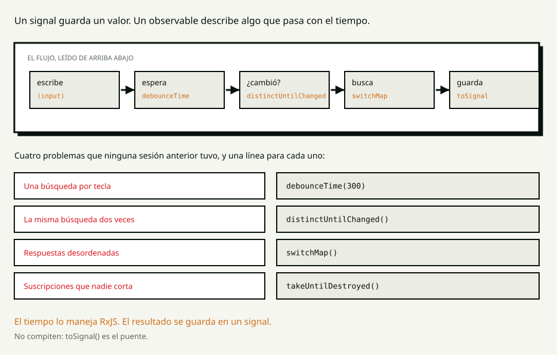

<!-- _class: portada -->

# S6

## Reactividad

<!--
Módulo Angular · Talento DH 8va.
El guión completo está en guion.md y es un teleprompter. Tecla P para las notas.
-->

---

<!-- _class: bloque -->

# 0:00

## Pregunta de apertura

---

## Escribes siete letras en un buscador

# ¿Cuántas veces le preguntó al servidor?

<!--
90 segundos. Van a decir 1, 7, "una por letra". TODAS SIRVEN.

"Los dos números que están diciendo son los dos extremos, y los dos son reales:
hay buscadores que preguntan una vez y buscadores que preguntan siete."

"Hoy vamos a escribir el de siete —que es el que sale solo— y después vamos a
convertirlo en el de una, con tres líneas."
-->

---

<!-- _class: bloque -->

# 0:05

## Wayground

## de S5

<!--
sesiones/s05-inyeccion-dependencias/wayground.csv. Máximo 30 segundos por
pregunta.
-->

---

<!-- _class: bloque -->

# 0:12

## El concepto

## Editor cerrado

---

<!-- _class: ojo -->

# Hasta ayer los datos estaban

Desde hoy **llegan**.

Y con eso aparece el tiempo.

<!--
DOS MINUTOS.

"Hasta la clase pasada, los datos ESTABAN: una constante, un signal, y listo.
Desde hoy los datos LLEGAN."

"Y el tiempo trae problemas que no existían. Uno: llegan tarde. Dos: llegan
desordenados. Tres: a veces no llegan y llega un error. Cuatro: llegan cuando ya
no le importan a nadie, porque el usuario se fue a otra pantalla."
-->

---

## Promesa y observable

| | Promesa | Observable |
|---|---|---|
| Cuántos valores | **uno** | ninguno, uno o muchos |
| Cuándo empieza | al crearla | **al suscribirse** |
| Se puede cancelar | no | **sí** |

<!--
DOS MINUTOS.

"Una promesa es una caja que en algún momento va a tener una cosa adentro. Un
OBSERVABLE es una descripción de valores que van a ir llegando."

"Y la diferencia que más se paga es la segunda: un observable es FRÍO. No pasa
nada hasta que alguien SE SUSCRIBE. Escribir la búsqueda no busca nada; buscar
es suscribirse."

Vuelve a las 1:20 como ejercicio de predicción.
-->

---

## El flujo, y los cuatro problemas



<!--
CUATRO MINUTOS. Es el índice del live coding.

La tubería se lee como una frase: ESCRIBE, ESPERA, ¿CAMBIÓ?, BUSCA, GUARDA.

DETENTE EN EL TERCERO, que es el que nadie ve venir:
"Escribes una letra: sale una búsqueda que va a tardar un segundo. Escribes tres
más: sale otra que tarda trescientos milisegundos. LA SEGUNDA CONTESTA PRIMERO,
y después llega la primera y le pisa los resultados."

"El usuario ve resultados que no corresponden a lo que escribió, y no hay ningún
error. switchMap cancela la anterior cada vez que llega una nueva."

Y el cierre del bloque:
"Signals y observables NO COMPITEN. Un signal guarda un valor; un observable
maneja el tiempo. toSignal() es el puente."
-->

---

<!-- _class: bloque -->

# 0:20

## Live coding

## Ustedes miran

<!--
Proyecto: lab/demo, ruta /s06.

TEN EL CONTADOR DE BÚSQUEDAS A LA VISTA TODO EL BLOQUE. Es el marcador de la
clase.
-->

---

<!-- _class: ojo -->

# Siete teclas, siete búsquedas

<!--
0:20 — Escribe `etiopía` letra por letra y DESPACIO, señalando el contador.

"Esto NO ESTÁ MAL ESCRITO: es lo que sale solo, es lo que escribe cualquiera la
primera vez, y hace exactamente lo que dice. Está mal PENSADO EN EL TIEMPO, que
es otra cosa."

Y después el bug que importa: Reiniciar, escribe UNA LETRA, espera un segundo
entero, escribe `huila`.

"Apareció Huila… y después se llenó de resultados de la letra sola. La respuesta
vieja llegó última y ganó. Y no hay ningún error, ni en la consola ni en ningún
lado."
-->

---

<!-- _class: codigo -->

## Un flujo en vez de una llamada · 0:23

```ts
private readonly terms = new Subject<string>();

private readonly results$ = this.terms.pipe(
  switchMap((term) => this.catalog.searchCounted(term)),
);

protected readonly results = toSignal(this.results$, { initialValue: [] });
```

<!--
"Un Subject es un observable AL QUE SE LE EMPUJA desde afuera. Cada tecla ya no
busca: deja caer un texto en el flujo."

"toSignal es el puente: ENTRA UN OBSERVABLE, SALE UN SIGNAL. Y de ahí para abajo
el template es el mismo de la clase 3 — results(), con paréntesis."

REPITE EL BUG: una letra, esperar, huila. Ya no pasa.
"switchMap CANCELA la búsqueda anterior. La vieja no llega porque la cortamos."
-->

---

<!-- _class: codigo -->

## De siete a una · 0:27

```ts
debounceTime(300),
distinctUntilChanged(),
```

<!--
Reinicia el contador y escribe `etiopía` letra por letra, al ritmo normal.
UNA.

"debounceTime espera 300 ms SIN QUE LLEGUE NADA NUEVO. Mientras escribes, el
reloj se reinicia con cada tecla."

"distinctUntilChanged descarta el texto si es igual al anterior. Parece que
nunca pasa, y pasa todo el tiempo: borras una letra y la vuelves a escribir."

"Y lo mejor es que no hay que acordarse de nada. No hay un if en el componente:
ESTÁ EN EL FLUJO."
-->

---

<!-- _class: codigo -->

## Los tres estados · 0:30

```ts
switchMap((term) =>
  this.catalog.searchCounted(term).pipe(
    catchError(() => {
      this.status.set('error');
      return of([]);
    }),
  ),
),
```

## El `catchError` va **adentro**.

<!--
"Desde hoy, toda pantalla que cargue algo tiene TRES estados: cargando, vacío y
error. Es un punto de la definición de terminado del curso y arranca en esta
clase — antes no aplicaba, porque no había nada que cargar."

Escribe `error`, muestra el mensaje, y después escribe `huila`: sigue andando.

Y SEÑALA LA POSICIÓN CON EL CURSOR:
"Si estuviera afuera, el error mataría el flujo entero: el buscador dejaría de
funcionar PARA SIEMPRE, hasta recargar. Adentro, solo muere esa búsqueda."
-->

---

<!-- _class: codigo -->

## Que se corte solo · 0:33

```ts
takeUntilDestroyed(),
```

<!--
"Un flujo vive hasta que alguien lo corta. Si el usuario se va a otra pantalla,
el componente se destruye y LA SUSCRIPCIÓN SIGUE VIVA, apuntando a algo que ya
no existe."

"Con un buscador es una fuga de memoria. Con un temporizador o un socket —que es
la clase 10— es una fuga que además SIGUE TRABAJANDO."

"Y funciona sin pasarle nada porque estamos en un campo de la clase, que es un
contexto de inyección. Es lo de la clase pasada, otra vez."
-->

---

<!-- _class: bloque -->

# 0:35

## Misión 1

## De siete búsquedas a una

<!--
15 minutos, lab/starter. Enunciado en mision-estudiante-1.md.

DILO ANTES DE LARGAR:
"Empieza por el Subject y el switchMap, SIN los otros operadores: que la
pantalla siga funcionando. Los tiempos después. Si pones los cinco de una y no
anda, no vas a saber cuál es."

Reloj de pistas: 0:43 y 0:47.
-->

---

## Misión 1 — los seis

1. La ruta `/s06`
2. `debounceTime` + `distinctUntilChanged` → **una** búsqueda
3. `switchMap` → gana siempre la última
4. Los tres estados, **y el error no mata el buscador**
5. `takeUntilDestroyed`
6. `toSignal`

<!--
Déjala en pantalla los quince minutos. El 4 es el que separa.
-->

---

<!-- _class: bloque -->

# 0:50

## Comparten pantalla

<!--
PREGUNTAS, NO CORRIGES:
1. "¿Cuántas búsquedas salen si escribo siete letras? ¿Cómo lo sabes?"
2. "¿Qué pasa si el servidor tarda dos segundos y escribo otra cosa mientras?"
3. "¿Quién corta esa suscripción?"
4. "¿Qué ve el usuario mientras espera?"

Lo más probable: el catchError quedó afuera del switchMap.
"Escribe error y después otra cosa. ¿Funciona? Ese es el bug, y es silencioso."
-->

---

<!-- _class: bloque -->

# 1:00

## Descanso

## 10 minutos

---

<!-- _class: bloque -->

# 1:10

## Predice y ejecuta

<!--
Las tres respuestas están MEDIDAS con fakeAsync, no razonadas.
mostrar → 60 segundos → ejecutar → explicar.
-->

---

<!-- _class: codigo -->

## 1 · `mergeMap` en vez de `switchMap`

```ts
mergeMap((term) => this.catalog.searchCounted(term)),
```

## Escribo `e`, espero, escribo `huila`. ¿Qué queda?

<!--
QUEDAN LOS RESULTADOS DE `e`.

Medido: a los 300 ms se ve [Huila]; a los 1500 ms se ve
[Yirgacheffe, Cerrado, Antigua, Sidamo, Kiambu] — los de la letra sola.

"La pantalla termina mostrando los resultados de una búsqueda que el usuario ya
había abandonado, y el campo de texto dice huila."

LA REGLA: si solo importa el último, switchMap. Si importan todos —subir cinco
archivos—, mergeMap.

"Y con red rápida NO PASA NUNCA: aparece con la red que tienen los usuarios y no
tenemos nosotros."
-->

---

<!-- _class: codigo -->

## 2 · El `catchError` un renglón más arriba

```ts
switchMap((term) => this.api.search(term)),
catchError(() => of([])),
```

## Escribo `error`, y después `huila`. ¿Qué pasa?

<!--
NO PASA NADA. LA PANTALLA SE QUEDA COMO ESTABA, PARA SIEMPRE.

Medido: tras el error, el flujo emitió 1 vez. Tras escribir huila, siguió en 1.

"UN ERROR EN UN OBSERVABLE ES TERMINAL: el flujo se acaba. catchError no lo
revive; atrapa el error y decide con qué SEGUIR."

"No hay error en la consola. El usuario escribe, no pasa nada, y no hay nada que
mirar. Para cuando alguien lo reporta, ya recargó y no se reproduce."
-->

---

<!-- _class: codigo -->

## 3 · Una búsqueda que nadie mira

```ts
protected precargar(): void {
  this.catalog.searchCounted('etiopía');
}
```

## Toco el botón cinco veces. ¿Cuánto marca el contador?

<!--
CERO.

"Un observable es FRÍO: no pasa nada hasta que alguien se suscribe.
searchCounted no busca: DEVUELVE UNA RECETA."

Agrega .subscribe() al final y vuelve a tocar: pasa a 5.

La comparación:
fetch('/api/coffees')     → ya salió, aunque nadie mire
this.catalog.search('x')  → no salió nada

La yapa: "¿y por qué HttpClient a veces funciona sin suscribirse?" — nunca
funciona sin suscribirse. AsyncPipe, toSignal y firstValueFrom SE SUSCRIBEN POR
TI.

CIERRE: "los tres son creer que el tiempo no existe."
-->

---

<!-- _class: bloque -->

# 1:25

## Misión 2

## El buscador que no molesta al servidor

<!--
20 minutos, en parejas.

TRES COSAS ANTES DE LARGAR:
1. "Hoy el buscador filtra una constante, así que el debounce no se nota.
   Pónganlo igual: en la clase 7 cada búsqueda va a ser una petición."
2. "El campo pasa de [(ngModel)] a (input). Lo que hace falta es el EVENTO."
3. "El texto que se ve y el texto con el que se filtra DEJAN DE SER EL MISMO."
-->

---

## Misión 2 — dos textos, no uno

| Qué | Quién lo tiene | Cuándo cambia |
|---|---|---|
| Lo que se ve en el campo | el componente | en cada tecla |
| Lo que filtra la lista | `RaceStore` | al dejar de escribir |

<!--
Déjala en pantalla los veinte minutos.

Es el paso que se piensa mal la primera vez. Si el campo leyera del store, la
letra recién escrita desaparecería mientras el debounce espera. Se puede probar.
-->

---

<!-- _class: bloque -->

# 1:45

## Code review

<!--
Rúbrica del curso, más las preguntas de hoy:

"¿Dónde está el catchError? ¿Y qué pasa si estuviera un renglón más arriba?"
"¿Quién corta esa suscripción? Si la respuesta es nadie, es una fuga."

Los cinco errores de todos los años están en correccion.md — incluido el que NO
es un error: guardar la suscripción y cortarla en ngOnDestroy.
-->

---

<!-- _class: ojo -->

# Nada de esto cambia en la clase 7

`search()` va a dejar de ser un `of()` y va a ser `HttpClient`.

El componente no se entera.

<!--
EL CIERRE DE LA SESIÓN.

"Devuelve un observable, y eso es lo único que a este flujo le importa."

"Y esa es toda la razón por la que hicimos las seis clases anteriores en este
orden."
-->

---

<!-- _class: bloque -->

# 1:55

## Exit ticket

## y tarea

<!--
Tarea: LÉELA EN VOZ ALTA. El punto 1 —romper las tres cosas a propósito y
describir el síntoma— es el que más enseña.
-->

---

<!-- _class: portada -->

# Hasta la próxima

## S7 · HttpClient

<!--
El anzuelo:
"La clase que viene conectamos el backend de verdad. Van a ver que casi no hay
que tocar nada."
-->
